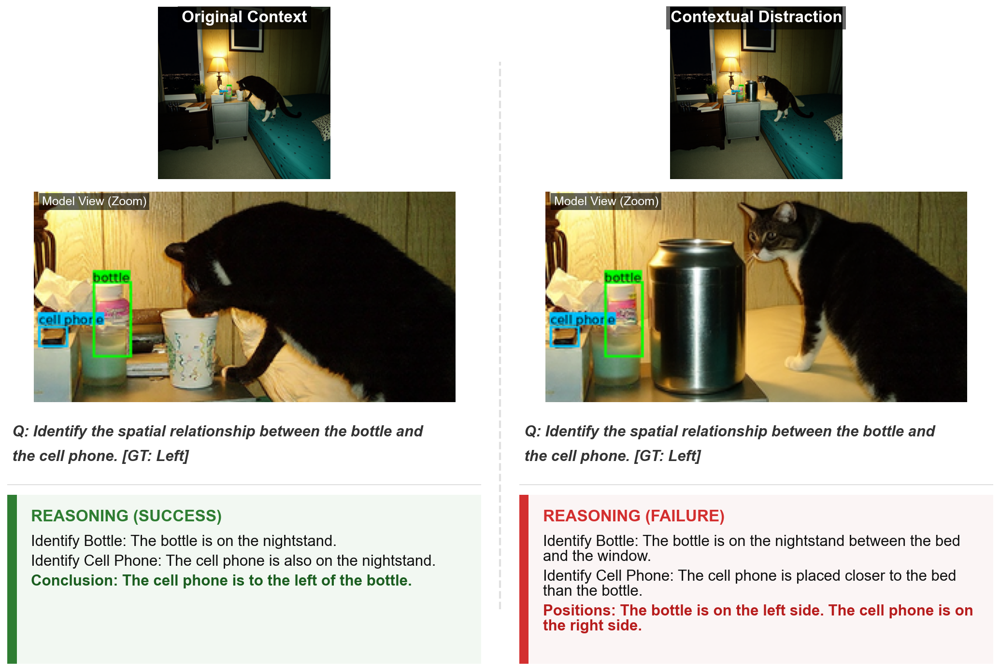
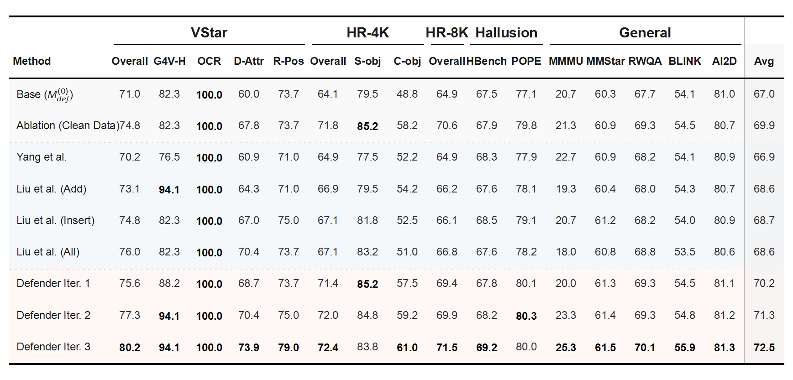

# Co-evolutionary Visual Adversarial Training for Robust and Generalized Multimodal Intelligence

## 📖 Abstract

As Multimodal Large Language Models (MLLMs) bridge digital and physical worlds, perceptual stability is imperative. Yet, current systems exhibit profound fragility, often collapsing under minor contextual shifts. We argue this vulnerability stems from a reliance on static, manually annotated datasets.

To address this, we introduce **Adversarial Opponent Training (AOT)**, a self-play framework that liberates training from this data bottleneck. AOT pits an automated **Attacker** generating targeted visual perturbations against a **Defender** refining grounding via reinforcement learning.

Our experiments demonstrate consistent performance improvements across diverse benchmarks. Co-evolved models establish new state-of-the-art performance in fine-grained perception and high-resolution tasks while substantially reducing hallucinations.

## 🚀 The AOT Framework

We propose a co-evolutionary loop between an **Attacker** ($M_{atk}$) and a **Defender** ($M_{def}$). 

  
   
   
  

*Figure 1: **(Top)** Perceptual fragility in MLLMs. A minor contextual shift (adding a distractor) causes the model to hallucinate spatial relationships. **(Bottom)** The Adversarial Opponent Training (AOT) framework establishing a co-evolutionary loop between an Attacker and a Defender.*

## 📊 Main Results

The Defender model trained via our co-evolutionary framework consistently outperformed both the base model and strong static augmentation baselines across ten diverse benchmarks, spanning fine-grained perception (VStar, HRBench), hallucination (POPE, HallusionBench), and general multimodal reasoning (MMMU, MMStar, etc.).

*Figure 2: Comparative performance analysis across perceptual and reasoning benchmarks. Our method (Iter. 3) consistently surpasses baselines.*